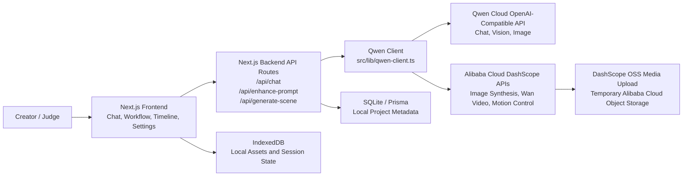

# OpenScene

OpenScene is an AI showrunner workspace for creating short-form video projects with Qwen Cloud. It guides a creator from brief to script, storyboard, asset generation, motion/video generation, review, timeline assembly, and export planning.

**Submission track:** AI Showrunner

## Repository URL

Judging repository: https://github.com/ahmad-kaddoura/openscene

This repository includes the source code, assets, setup instructions, and an MIT open source license.

## Features

- Conversational AI showrunner for short drama and campaign ideation.
- Script, hook, storyboard, influencer, background, frame, and workflow planning agents.
- Qwen Cloud chat, vision, image generation, and Wan video generation routing.
- Motion-control scene generation through DashScope async task APIs.
- Visual workflow graph for moving from creative plan to generated assets.
- Timeline editor for clips, overlays, audio, aspect ratio, and export summaries.
- Local project persistence, asset library, brand kit, usage view, and configurable model effort.

## Qwen Cloud And Alibaba Cloud Proof

The backend integrates with Alibaba Cloud DashScope/Qwen APIs in [`src/lib/qwen-client.ts`](src/lib/qwen-client.ts). API routes call that backend client from:

- [`src/app/api/chat/route.ts`](src/app/api/chat/route.ts)
- [`src/app/api/enhance-prompt/route.ts`](src/app/api/enhance-prompt/route.ts)
- [`src/app/api/generate-scene/route.ts`](src/app/api/generate-scene/route.ts)
- [`src/app/api/health/route.ts`](src/app/api/health/route.ts)

Deployment proof details and recording placeholders are in [`docs/alibaba-cloud-deployment-proof.md`](docs/alibaba-cloud-deployment-proof.md).

## Architecture



More detail is available in [`docs/architecture.md`](docs/architecture.md).

## Setup

1. Install dependencies:

```bash
npm install
```

2. Create the environment file:

```bash
cp .env.example .env
```

3. Add your Qwen Cloud key from https://home.qwencloud.com/api-keys:

```bash
QWEN_API_KEY=sk-...
QWEN_BASE_URL=https://dashscope-intl.aliyuncs.com/compatible-mode/v1
IMAGE_GEN_API_KEY=sk-...
IMAGE_GEN_BASE_URL=https://dashscope-intl.aliyuncs.com/compatible-mode/v1
VIDEO_GEN_API_KEY=sk-...
VIDEO_GEN_BASE_URL=https://dashscope-intl.aliyuncs.com/compatible-mode/v1
TTS_API_KEY=sk-...
TTS_BASE_URL=https://dashscope-intl.aliyuncs.com/compatible-mode/v1
DATABASE_URL="file:./db/dev.db"
```

4. Prepare the local database:

```bash
npm run db:generate
npm run db:push
```

5. Run locally:

```bash
npm run dev
```

Open http://localhost:3000.

## Production Build

```bash
npm run build
npm start
```

The included [`Caddyfile`](Caddyfile) reverse-proxies traffic to the Next.js server on port 3000, which is the deployment shape used for an Alibaba Cloud ECS-style VM.

## Submission Links

Use [`SUBMISSION.md`](SUBMISSION.md) as the final copy/paste checklist for the judging portal.
