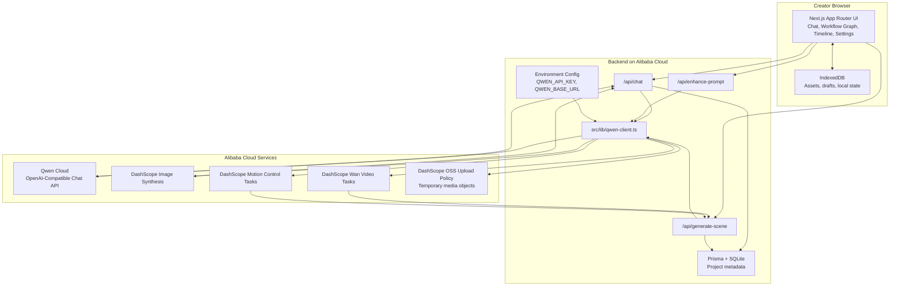

# Architecture

## Flow

1. The browser sends creative instructions, storyboard changes, or generation requests to the Next.js backend.
2. Backend API routes load the Qwen Cloud configuration and route the task through `src/lib/qwen-client.ts`.
3. Text and vision planning use the Qwen Cloud OpenAI-compatible chat endpoint.
4. Image generation first tries the OpenAI-compatible image endpoint, then falls back to DashScope image synthesis when needed.
5. Video and motion-control work is submitted to Alibaba Cloud DashScope async task endpoints and polled until completion.
6. Local project metadata is stored through Prisma/SQLite, while larger client-side creative state and assets can remain in IndexedDB.
